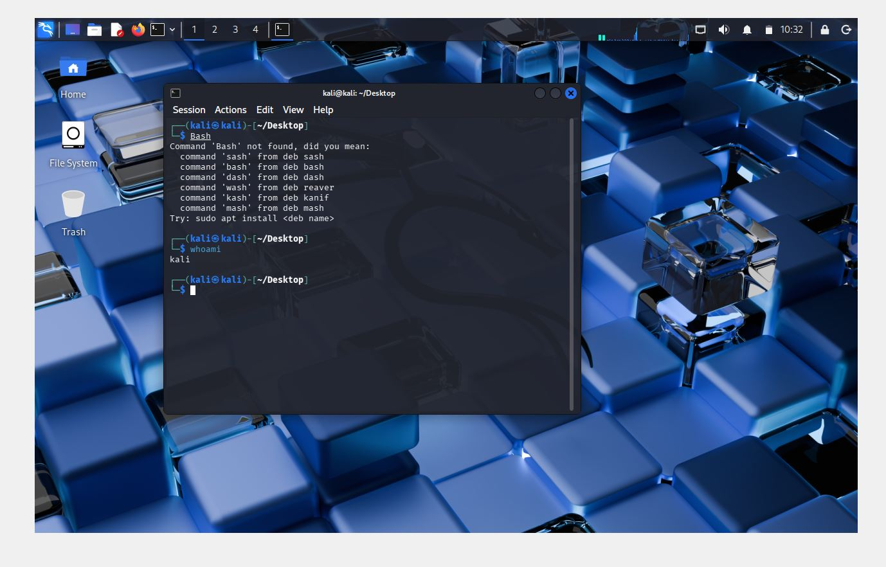

# Cybersecurity Home Lab

## Overview
This repository documents my beginner cybersecurity home lab.

## 🎯 Project Purpose

The goal of this lab is to create a controlled cybersecurity environment where I can safely practise fundamental security skills such as system navigation, command-line usage, and tool interaction.

This lab will be used for future activities including:
- Network analysis (Wireshark)
- Vulnerability scanning
- Basic penetration testing exercises

## Objective
The goal of this lab is to build a safe practice environment where I can learn cybersecurity fundamentals, test basic tools, and improve my understanding of networking, scanning, and system setup.

## Tools Used
- VirtualBox
- Kali Linux
- Windows virtual machine

## Lab Goals
- Build a basic virtual lab
- Practise safe testing in a controlled environment
- Learn how virtual machines communicate
- Document my work clearly

## Repository Structure
- README.md
- screenshots/
- notes/
- diagrams/

- ## 📸 Lab Setup Evidence

### VirtualBox Running Kali

### Kali Terminal Access

## 🔜 Next Steps

- Explore Linux file system commands
- Install and use Wireshark for packet analysis
- Complete TryHackMe beginner rooms
- Document findings and screenshots for each activity
- 
## Status
## ✅ Current Progress
- Kali Linux installed and running successfully
- VirtualBox environment configured
- Initial lab setup completed
- Basic command-line interaction tested
